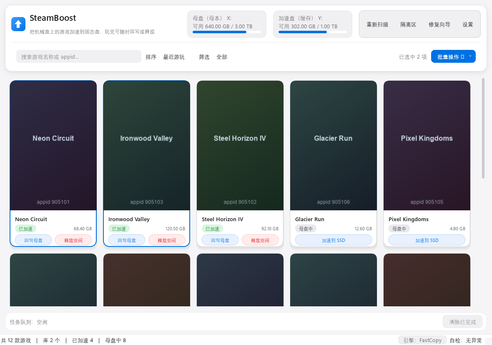
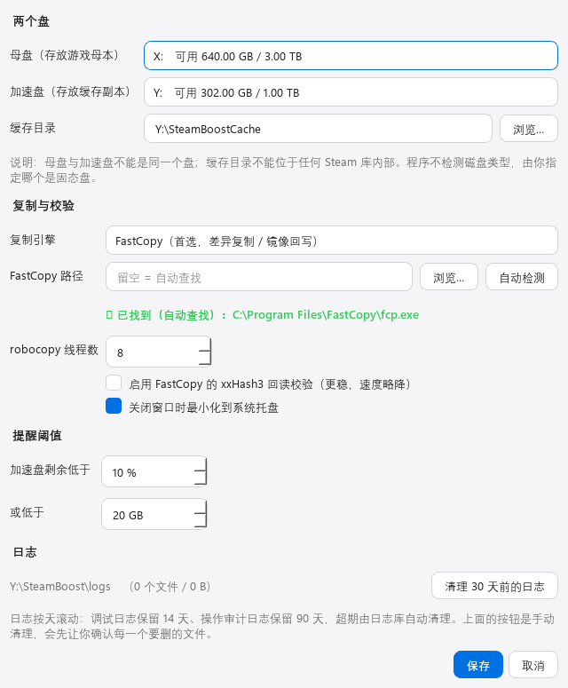
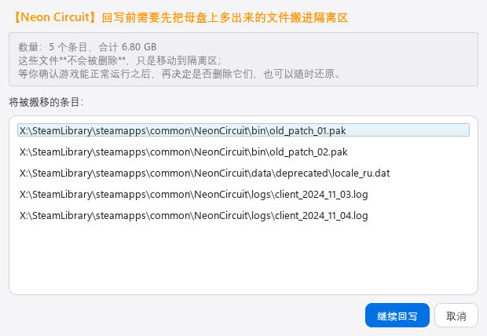

# SteamBoost —— Steam 游戏 SSD 加速缓存工具

把机械硬盘上的 Steam 游戏"借"到固态盘上玩，玩完把差异回写母本、再释放固态盘空间。
**Steam 全程无感知**：它看到的永远是原来的路径，实际读取的是固态盘上的副本。

```
加速前                                          加速后
<母盘>:\SteamLibrary\...\common\GameDir\        <母盘>:\SteamLibrary\...\common\GameDir  ← 目录联接（Junction）
                                                             │  重定向
<加速盘>:\SteamBoostCache\<appid>_GameDir\  ← 游戏完整副本，Steam 真正读写的就是这里
<母盘>:\SteamLibrary\...\common\.hdd_cache\GameDir\  ← 母本真身（回写目标）
```

> 上面用 `<母盘>` / `<加速盘>` 占位，具体盘符由你在设置里选，程序不预设任何盘符。

---

## 界面



| 设置 | 回写前的"多余文件"确认 |
|---|---|
|  |  |

> 截图里的盘符、游戏、容量**全部是虚构的**（由 `tools/make_demo_shot.py` 渲染）。
> 真实扫描出来的截图会带上本机的盘符、库路径与用户名，不适合放进公开仓库——
> `tests/test_portability.py` 会检查 `docs/` 里只有这几张虚构图。

---

## 一、它解决什么问题

典型场景：**一块大容量机械盘存游戏，一块小容量固态盘装不下所有游戏**。

- **加速**：把选中的游戏从机械盘复制到固态盘，并在原位置建立目录联接，
  Steam 完全无感，启动游戏时享受固态盘的读取速度；
- **回写**：随时把固态盘上的差异（补丁 / 更新 / 新增文件）同步回机械盘母本，
  **保持加速状态不变**——把"数据不同步的风险窗口"从几天缩短到一次游戏；
- **释放**：回写 → 校验 → 摘掉联接 → 母本回原位 → 删除固态盘副本，回收空间。

母本**始终完整可用**：母本先改名到暂存区（同卷改名，瞬间完成），
任何一步失败都会回滚；回写校验不通过绝不继续；删除缓存副本前必须由你确认。

---

## 二、系统要求

| 项目 | 要求 |
|---|---|
| 操作系统 | Windows 10 / 11（需要 NTFS，目录联接只能用在本卷） |
| 磁盘 | 一块机械盘（母盘，存游戏）+ 一块固态盘（加速盘，至少能放下要加速的游戏） |
| Steam | 任意版本（本工具读注册表与 `libraryfolders.vdf` / `appmanifest_*.acf`） |
| 运行方式 | 直接跑打包好的 `SteamBoost.exe`，或用 Python 3.11+ 跑源码 |

**权限**：创建目录联接（`mklink /J`）**不需要管理员权限**，本工具全程普通权限运行。

---

## 三、安装与首次使用

### 方式 A：直接运行 exe

```
dist\SteamBoost.exe
```

双击即可，无需安装 Python。

### 方式 B：源码运行

```powershell
pip install -r requirements.txt
python main.py
```

### 首次使用三步

1. **设置** → 选择**母盘**（存游戏母本的机械盘，例如 `F:`）与**加速盘**（放下副本的固态盘，例如 `D:`）
   - 程序不检测磁盘类型，由你指定；
   - 两个盘不能是同一个；缓存目录不能落在任何 Steam 库内部（会直接拒绝保存）。
2. **重新扫描** → 网格里出现你的游戏，卡片角标显示当前位置（`母盘中` / `已在加速盘` / `已加速`）。
3. 点卡片上的「**加速到 SSD**」→ 任务队列显示进度/速度/剩余时间。

> 加速期间**不要启动 Steam**：那几秒到几十秒里，游戏目录正处于"改名 → 复制 → 建联接"之间。
> 程序在开始前会检查 Steam 与游戏进程是否在运行，运行中会直接拒绝执行。

---

## 四、三个操作怎么看

| 操作 | 什么时候用 | 做了什么 | 状态变化 |
|---|---|---|---|
| **加速到 SSD** | 想玩某个在机械盘上的游戏 | 母本改名到 `.hdd_cache` → 复制到加速盘 → 校验 → 建联接 | 母盘中 → 已加速 |
| **回写母盘** | 玩完一次之后随手点一下 | 把加速盘上的差异镜像回母本（多余文件先搬进隔离区），**保持加速** | 已加速 → 已加速 |
| **释放空间** | 不想再占着固态盘 | 回写 → 严格校验 → 摘联接 → 母本回原位 → 删除副本 | 已加速 → 母盘中 |

**回写**是独立按钮，这是刻意的设计：它不改变加速状态，所以你可以"玩一次同步一次"。
固态盘万一出问题，最多只丢最后一次会话的更新。

**释放前一定会先回写并校验**，顺序是：

```
前置检查 → 确认删除缓存副本（此时什么都还没动）
        → 回写（多余文件搬进隔离区，需你确认）
        → 严格校验（文件数 / 总字节 / 逐文件大小与时间戳完全一致）
        → 摘除联接 → 母本回原位 → 删除缓存副本
```

中间任何一步失败或被你取消，**缓存副本都不会被删除**。

---

## 五、隔离区：为什么"多余文件"不是直接删除

释放/回写时，母本上可能存在"加速盘副本里已经没有"的文件（Steam 更新时删掉的老文件）。
直接删掉是不可逆的，所以本工具的做法是：

1. 把这些文件**移动**到 `<母盘>:\SteamBoostTrash\<appid>_<游戏名>_<时间戳>\`
   （同一块盘内改名，瞬间完成，不复制数据）；
2. 然后执行镜像回写——此时母本已经不多任何文件，**全程没有删除动作**；
3. 你启动游戏确认一切正常后，打开「隔离区」页再点「删除选中」真正释放空间；
4. 也可以点「还原选中」把它们搬回母本。

每个隔离项都带一份 `_steamboot_quarantine.json` 清单，程序**只删自己创建的隔离项**。

---

## 六、安全机制（这一节值得读）

| 机制 | 说明 |
|---|---|
| **删除闸门** | 全程序所有删除都必须经过 `deletion_guard`：默认**拒绝**（没有确认者时不执行任何删除）、路径白名单（只允许缓存副本 / 隔离项 / 日志三类）、拒绝盘根、拒绝 `\steamapps\` 下任何路径、拒绝系统与用户目录、拒绝把目录联接当普通目录删、执行前再复核一次路径 |
| **进程检查** | 任何改动文件结构的操作前，检查 `steam.exe` 与"映像位于该游戏目录内的进程"，未通过直接中止 |
| **回滚** | 加速失败/取消 → 清理半成品副本（需确认）+ 母本改名回原位；回滚本身失败会标记为"待修复"交给修复向导 |
| **校验** | 复制后做严格校验（文件数 + 总字节 + 逐文件大小与时间戳，时间戳精确比较）；回写后再校验一次 |
| **审计日志** | 每次加速 / 回写 / 释放 / 删除的路径、字节数、结果都写入 `logs\operations.log`（按天滚动，保留 90 天） |
| **修复向导** | 启动时自检：识别加速中断、回写中断、释放中断、联接损坏、无主母本、无主缓存副本，逐条给出安全选项，绝不自动"清理" |

**已知边界**：校验用的是"大小 + 时间戳"。如果文件内容变了但大小与时间戳都没变，
基于元数据的校验无法发现（真实场景里 Steam 更新发生在数小时之后，时间戳必然不同）。
需要覆盖这种情况时，可在设置里开启 FastCopy 的 xxHash3 回读校验。

---

## 七、注意事项

1. **存档与设置不受影响**：绝大多数游戏的存档在"文档"目录或 Steam 云上，
   不在游戏安装目录里，因此加速/释放不会动它们。放在游戏目录内的少数游戏，
   其存档也会随副本一起被回写同步。
2. **反作弊网游慎重**：本工具用目录联接，游戏看到的是原路径，绝大多数反作弊不受影响；
   但**不要在加速状态下手工改动游戏文件**，也不要在被反作弊保护时替换文件。
3. **不要在加速状态下用 Steam 的"验证游戏文件完整性"**：Steam 会按清单重写文件，
   这些改动会算作"差异"，之后回写时会被同步到母本（这是符合预期的，只是会让你多等一次回写）。
4. **不要在加速状态下用 Steam 卸载/移动该游戏**：那会绕过本工具，导致联接被删、
   母本成为"无主备份"。程序下次启动时会在修复向导里发现并帮你恢复。
5. **FastCopy 的许可**：本工具的复制引擎优先使用 [FastCopy](https://fastcopy.jp/)（`fcp.exe`）。
   FastCopy 从 5.0 起**仅限家庭/个人免费使用，工作场所使用需要 Pro 许可**。
   本程序**不捆绑、不再分发** FastCopy，只在你本机已安装时调用它；
   没有安装时会自动回退到 Windows 自带的 `robocopy`（速度稍慢，功能一致）。
6. **FastCopy 放在哪都行，不需要特定目录**。程序按下面的顺序查找 `fcp.exe`／`FastCopy.exe`：

   1. 设置页里手填的「FastCopy 路径」（留空则跳过这一步）
   2. 注册表卸载信息里记录的安装位置（即你当初装到哪就找哪）
   3. `%ProgramFiles%\FastCopy`、`%ProgramFiles(x86)%\FastCopy`、
      `%LOCALAPPDATA%\FastCopy`、`%APPDATA%\FastCopy`、`%LOCALAPPDATA%\Programs\FastCopy`
   4. 程序自己所在目录、`<程序目录>\FastCopy\`、`<程序目录>\tools\FastCopy\`
   5. 系统 `PATH`

   都找不到也不会报错退出，而是**明确告诉你**"未找到 FastCopy，已回退 robocopy"：
   设置页里那一行会变红字，主窗口状态栏右下角也会标出当前实际生效的引擎。
   所以装了 FastCopy 却没被识别时，一眼就能看出来，不会悄悄变慢。

---

## 八、文件位置

| 内容 | 位置 |
|---|---|
| 配置 | `%LOCALAPPDATA%\SteamBoost\config.json` |
| 任务状态 | `%LOCALAPPDATA%\SteamBoost\state.json` |
| 日志 | `%LOCALAPPDATA%\SteamBoost\logs\`（`steamboot.log` 14 天 / `operations.log` 90 天） |
| 封面缓存 | `%LOCALAPPDATA%\SteamBoost\covers\` |
| 游戏缓存副本 | `<加速盘>:\SteamBoostCache\<appid>_<安装目录名>\` |
| 母本暂存 | `<母盘库>\steamapps\common\.hdd_cache\<安装目录名>\` |
| 隔离区 | `<母盘>:\SteamBoostTrash\<appid>_<游戏名>_<时间戳>\` |

---

## 九、故障排查

| 现象 | 原因与处理 |
|---|---|
| 卡片按钮点不动 / 界面异常 | 先看状态栏与「修复向导」按钮上的数字；程序的自检会说明当前磁盘状态 |
| 加速被拒绝："Steam 客户端正在运行" | 完全退出 Steam（含托盘图标）后重试 |
| 加速被拒绝："加速盘剩余空间不足" | 先释放其他加速中的游戏，或换个加速盘 |
| 加速被拒绝："母本备份目录已存在" | 上次操作中断了，打开「修复向导」按提示继续或回滚 |
| 游戏在 Steam 里显示"未安装" | 说明联接没建立成功；打开「修复向导」，通常选「回滚到机械盘」即可恢复原状 |
| 想手工删缓存副本 | **不要直接删**。请用界面上的「释放空间」，它会先回写并校验；误删会产生"联接损坏"，修复向导能恢复母本，但你会白等一次重新加速 |
| 界面文字显示为方块 | 仅在无字体的离屏环境下出现；正常桌面运行不受影响 |

---

## 十、开发

### 目录结构

```
SteamBoost/
├─ main.py              程序入口（单实例、浅色主题、系统托盘）
├─ config.py            配置与两个盘的校验
├─ logger.py            调试日志 + 操作审计日志（按天滚动）
├─ steam_scanner.py     注册表 → libraryfolders.vdf → appmanifest → 文件系统事实
├─ junction_utils.py    目录联接与安全路径原语（创建/删除/白名单）
├─ process_guard.py     Steam 与游戏进程检查
├─ copy_engine.py       复制引擎（FastCopy / robocopy）、进度、校验
├─ quarantine.py        隔离区（移动而非删除）
├─ deletion_guard.py    删除闸门（默认拒绝 + 路径白名单 + 人类确认）
├─ state.py             任务状态持久化
├─ operations.py        加速 / 回写 / 释放三个操作
├─ repair.py            异常恢复：分析现场 + 安全修复动作
├─ steamboot_cli.py     命令行入口（加速/回写/释放/隔离区）
├─ ui/                  界面层（主题、封面、虚拟化网格、进度面板、对话框、控制器）
├─ tools/
│  ├─ make_icon.py      生成程序图标
│  └─ make_demo_shot.py 生成 README 里的展示截图（**纯虚构数据**，不读你的机器）
└─ tests/               9 个测试套件 / 378 项断言（另有界面截图、FastCopy 行为探测、打包写入诊断脚本）
```

### 测试

```powershell
# 全部测试（在隔离沙箱里跑，不碰真实游戏数据）
python tests\test_safety_primitives.py
python tests\test_scanner_fixture.py
python tests\test_copy_engine.py
python tests\test_quarantine.py
python tests\test_deletion_guard.py
python tests\test_operations.py
python tests\test_repair.py
python tests\test_portability.py    # 可移植性：代码里不得残留某台电脑的特征信息
python tests\test_gui_smoke.py      # 界面冒烟（离屏渲染）
python tests\screenshot_gui.py      # 生成界面截图（用真实扫描结果，仅供自己看）
python tools\make_demo_shot.py      # 生成 docs\ 里的展示截图（虚构数据，可以公开）
```

> `test_gui_smoke.py` 默认**不**在工作区留截图（截图必然带本机盘符等运行时信息）；
> 需要肉眼检查排版时用 `$env:STEAMBOOST_GUI_SHOTS=1` 打开。
> 要贴给别人看的图请用 `tools\make_demo_shot.py` 生成：它手工构造一份虚构的扫描结果
> （`X:` / `Y:` 两个盘、12 款不存在的游戏、占位封面），并把卷容量查询、系统盘列表、
> FastCopy 查找全部在运行期替换掉，因此图上一个真实路径都不会出现。

### 打包

```powershell
pip install -r requirements-dev.txt
python tools\make_icon.py                        # 生成 assets\steamboot.ico
# build 目录里会留下构建机的绝对路径（用户名、解释器位置），所以指到项目外
pyinstaller --clean --noconfirm --workpath "$env:TEMP\SteamBoost-build" SteamBoost.spec
```

发布产物是**文件夹版**：`dist\SteamBoost\SteamBoost.exe` 与同目录下的 Qt 运行库一起拷走即可用。
`tests\test_portability.py` 会检查工作区里没有残留 `build\` 目录。

> **为什么不用单文件 exe？**
> 单文件每次启动都要先把自己解压到临时目录并加固其权限，在部分系统上会被挡住，
> 表现为启动即弹 `Could not create temporary directory!`。
> 实测最小 hello-world 的单文件版同样失败，换 PyInstaller 版本、换临时目录、
> 指定 `--runtime-tmpdir` 都无效——属于环境限制，与本程序无关。
> 文件夹版不做解压，启动更快，也没有这个问题。

### 发布说明

每个版本的发布说明放在 `docs\release-notes-vX.Y.md`，发 Release 时直接复制这份内容过去；
里面同时记录该版本压缩包的 SHA256 校验值。v1.0 的那份见 [docs/release-notes-v1.0.md](docs/release-notes-v1.0.md)。

---

## 十一、许可

本项目代码采用 **[PolyForm Noncommercial License 1.0.0](LICENSE)**：
个人使用、研究、实验、业余爱好都可以，**商业使用不在授权范围内**。

```
SPDX-License-Identifier: PolyForm-Noncommercial-1.0.0
```

> **仓库侧边栏显示的是 "Other"，这是正常的**：GitHub 的许可识别只把自己那份"已知许可短名单"
> 拿来比对，PolyForm 不在名单里（那份名单里的许可全都允许商用）。
> 以 `LICENSE` 全文和上面这行 SPDX 标识为准。
>
> `LICENSE` 开头那行 `Required Notice: Copyright …` 是该许可要求随软件一起提供的署名声明。

复制引擎 FastCopy 由其作者 [FastCopy Lab, LLC](https://fastcopy.jp/) 提供，
**本程序不捆绑、不再分发**，只调用你本机已安装的副本；未安装时自动回退到 Windows 自带的 robocopy。
FastCopy 自 5.0 起**仅限家庭 / 个人免费使用**，工作场所使用需自行取得 Pro 许可。
